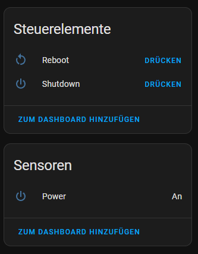

# pc2mqtt

Control your PC or homeserver with homeassistant or any other MQTT enabled home automation system.

## Usage

pc2mqtt run on your pc or homeserver and exposes its state and actions via MQTT.

## Exposed MQTT Components
- Power sensor
- Shutdown button
- Reboot button



## Getting Started / Installation

> Installation of pc2mqtt works a little different on windows vs linux.

### Linux

1. Download the latest binary from the releases
2. Setup a systemd service running the binary on start
3. Thats it

### Windows

For windows pc2mqtt uses the [windows-service-wrapper](https://github.com/winsw/winsw).

1. Download the latest windows zip archive from the releases
2. Unzip it to a directory of your choice
3. In cmd run `pc2mqtt.exe install` and `pc2mqtt.exe start` to install and start it as a windows service

Explaination: `wrapped.exe` is the actual binary. pc2mqtt.exe is the windows service wrapper which installs the service using the xml config file. For more info have a look at the [windows-service-wrapper](https://github.com/winsw/winsw).

## Config

When first starting the application, a `config.json` will be created right next to it. It looks like this:
```json
{
    "device_id": "63fbeebb-f107-4903-ab36-6104b9d802b0",
    "device_name": "MY-PC-HOSTNAME",
    "mqtt": {
        "host": "<YOUR MQTT HOST>",
        "port": 1883,
        "username": "<MQTT USER>",
        "password": "<MQTT PASSWORD>",
        "auto_discovery_prefix": "homeassistant"
    },
    "debug_mode": false
}
```

### Parameter descriptions

| Parameter                   | Description                                                              | Default Value                    |
|-----------------------------|--------------------------------------------------------------------------|----------------------------------|
| `device_id`                 | A generated id to identify your device.                                   | Generated. Can be changed        |
| `device_name`               | How your device will be named in eg. homeassistant.                       | Defaults to hostname             |
| `mqtt.host`                 | Your MQTT hostname eg. 192.168.0.10.                                      |                                  |
| `mqtt.port`                 | Your MQTT port.                                                           | 1883                             |
| `mqtt.username`             | Your MQTT username.                                                       |                                  |
| `mqtt.password`             | Your MQTT password.                                                       |                                  |
| `mqtt.auto_discovery_prefix`| The prefix used for the auto discovery messages.                          | `homeassistant`                  |
| `debug_mode`                | Enabled debug mode. Prints more logs and adds a "test" button.             |false                              |

